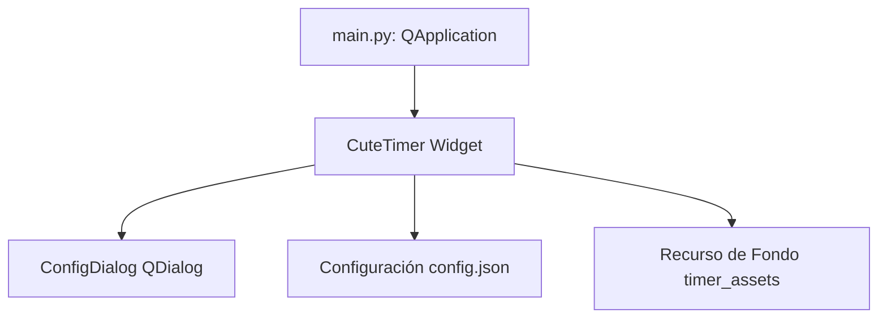

# Detalle del Proyecto: CuteTimer

## Arquitectura del Sistema
CuteTimer es una aplicación de escritorio basada en una interfaz gráfica circular sin marcos (frameless), desarrollada en Python utilizando la biblioteca PyQt5. El almacenamiento de configuraciones es persistente a través de un archivo JSON localizado en el directorio de documentos del usuario.

## Flujo de Funcionamiento
1. **Inicialización**: Carga `config.json` en `~/Documents/CuteTimer/`.
2. **Ciclo de Eventos**: QTimer actualiza el temporizador o cronómetro cada segundo.
3. **Pintado Gráfico**: `paintEvent` dibuja un fondo elíptico (o imagen), un arco de progreso proporcional al tiempo transcurrido y el texto del temporizador.
4. **Persistencia**: Se guardan los cambios de tiempo, transparencia, paleta, grosor y banderas en `config.json`.

## Descripción Detallada de Funciones

### `ConfigDialog`
Permite al usuario cambiar los parámetros del temporizador:
- Tiempo inicial, paleta de colores, transparencia, tamaño de texto, grosor del borde, tamaño de la ventana y banderas.
- Permite adjuntar y limpiar imágenes de fondo.

### `CuteTimer`
Clase principal que hereda de `QWidget`:
- **Atajos Globales**: Registra la tecla `Espacio` globalmente en Windows usando `RegisterHotKey`.
- **`paintEvent`**: Renderiza el círculo, el arco de progreso y el texto formateado.
- **`update_time`**: Controla el decremento/incremento de tiempo y activa la alerta visual (parpadeo en rojo) al terminar.

## Modularización y Dependencias
- **Python 3.x**
- **PyQt5**: Para la interfaz gráfica de usuario.
- **ctypes / wintypes**: Para los atajos de teclado globales en sistemas operativos Windows.
- **json, os, shutil, sys**: Módulos nativos para persistencia de datos y gestión de archivos.
